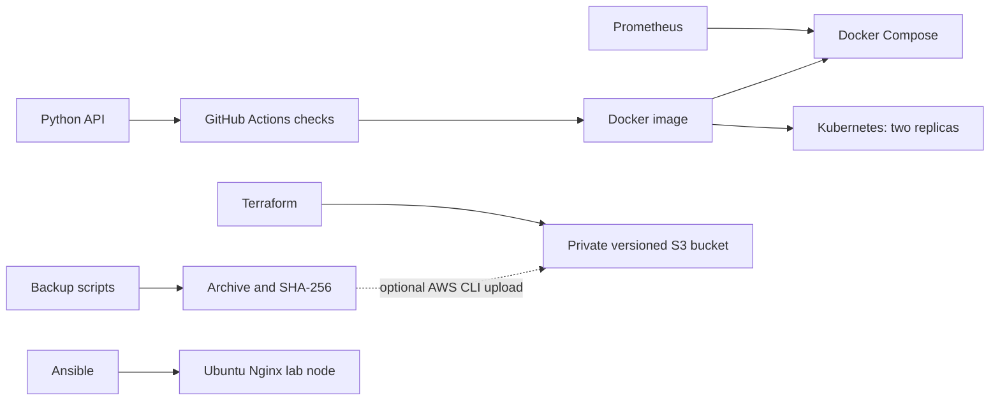

# DevOps Operations Lab

Hands-on projects for practicing Junior DevOps Engineer tasks. Start with Docker, then Kubernetes, monitoring, and finally automation and cloud infrastructure. Runtime files and technical documentation are kept in English to suit working within an international team.

| Folder | Project | Skills |
| --- | --- | --- |
| [docker](docker/README.md) | HTTP service inside an unprivileged container | Dockerfile, Compose, health checks, logs |
| [kubernates](kubernates/README.md) | Deploying the service with two replicas and rolling updates | Kubernetes, Kustomize, probes, rollback |
| [ci-cd](ci-cd/README.md) | Code and infrastructure linting and container build | GitHub Actions, tests, release procedure |
| [terraform](terraform/README.md) | Private backup storage on AWS | S3, encryption, versioning, TLS, IaC |
| [ansible](ansible/README.md) | Provisioning an Ubuntu server with Nginx service | configuration management, handlers, idempotency |
| [monitoring](monitoring/README.md) | Service monitoring and outage alerting | Prometheus, PromQL, incident triage |
| [automation](automation/README.md) | File backup, restoration, and Linux diagnostics | Bash, checksums, backup verification |

## Getting Started on Windows

Run Docker Desktop in Linux containers mode, then execute from this directory:

```powershell
docker compose -f docker/compose.yaml up -d --build --wait
curl.exe http://localhost:8080/healthz
```

Bash and Ansible projects require Linux or WSL. Kubernetes requires a local cluster such as kind. Terraform requires an AWS account and credentials via a profile or SSO; running apply creates resources that may incur costs.

These are local labs and not a public production service: the API uses Python's simple HTTP server, and there is no TLS gateway or user authentication. The files do not contain access keys or claims of production expertise.

## Architecture



## How to Present Your Work in an Interview

Run each project, perform the failure exercise, and keep your actual results: run commands, root cause of the failure, diagnostic steps, and fix procedure. Explain why readiness vs liveness probes were used, backup limitations, and the difference between Terraform and Ansible. Refer to the [Validation Record](VALIDATION.md) to see what was tested locally.

