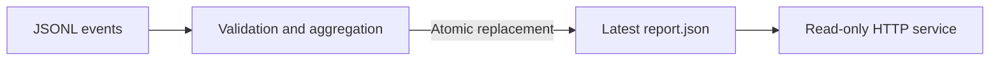

# Log Pipeline

A scheduled batch-processing project that turns JSONL request logs into a compact traffic report. It validates each event, counts HTTP status classes, calculates average response time, and reports rejected line numbers without copying raw log contents into the output.

The same Python job runs on demand through Docker Compose and every five minutes as a Kubernetes CronJob. A small read-only report service exposes the latest result. Terraform and Ansible provide an optional AWS/K3s host; GitLab tests and packages the job.



## Local run

Requirements: Docker with Compose and Bash. From this directory:

```bash
bash scripts/run.sh
curl http://localhost:8085/report.json
```

The script processes `data/events.jsonl`, saves `output/report.json`, and starts the report service. The sample contains three valid events and one rejected event. Expected results include two 2xx responses, one 5xx response, and an average duration of 50 milliseconds.

On Linux, the script passes your UID and GID to Compose so output files belong to you. On Windows, use a Bash environment with working Docker bind mounts. The container's default non-root user is used by the packaged smoke test.

Input format:

```json
{"status":200,"duration_ms":25}
```

Status must be an integer from 100 to 599. Duration must be an integer from 0 to 3,600,000 milliseconds. Invalid lines are counted and skipped. A batch with no valid events fails and preserves the previous report. The result is written to a temporary file and atomically replaces the previous report only after processing succeeds.

## Run without containers

Python 3 is enough to process a file or run the tests:

```bash
python3 app/pipeline.py --input data/events.jsonl --output output/report.json
python3 -m unittest discover -s tests -v
```

Reprocessing the same input produces the same report. This job overwrites the latest report; it does not append duplicate totals. It does not track file offsets or ingest a live log stream.

## Kubernetes

```bash
kind create cluster --name log-pipeline
docker build -t log-pipeline:dev .
kind load docker-image log-pipeline:dev --name log-pipeline
export KUBE_CONTEXT=kind-log-pipeline
export IMAGE=log-pipeline:dev
bash scripts/deploy.sh
kubectl --context "$KUBE_CONTEXT" -n log-pipeline port-forward service/reports 8085:80
```

The deployment creates sample input in a ConfigMap, an output PVC, a CronJob and the report reader. It also runs a verification Job and waits for completion. The CronJob uses `concurrencyPolicy: Forbid`, a deadline and bounded retries. That concurrency policy applies to scheduled runs, not manually created Jobs; avoid starting manual jobs while another run is writing.

To change the scheduled input, update the `events` ConfigMap in `kubernetes/workloads.yaml` and redeploy. Editing the local sample file alone does not change an existing ConfigMap. ConfigMaps are suitable for this tiny sample; larger datasets should live on dedicated storage. The PVC is shared by a writer and reader on the single-node kind/K3s lab. A multi-node deployment needs appropriate shared storage or scheduling rules.

## Failure exercise

Back up the sample, replace it with invalid lines, and run the job. It should exit nonzero while keeping the previous `report.json`. Restore the sample and rerun. The unit tests cover this behavior and repeat-run consistency.

The report may contain rejection metadata, so keep it private even though raw lines are omitted. There is no authentication or TLS on the local reader. Empty or very large input needs an explicit operational policy; this implementation keeps rejection details in memory and targets small batches.

See [GitLab setup](docs/CI.md), [cloud provisioning](docs/CLOUD.md), and [validation results](VALIDATION.md). Stop the reader with `docker compose down`; generated output remains in `output/`. Deleting the kind cluster deletes its local reports. For scheduled-job behavior, see the [Kubernetes CronJob documentation](https://kubernetes.io/docs/concepts/workloads/controllers/cron-jobs/).
