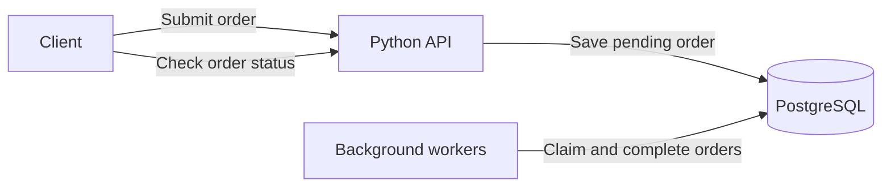

# OrderFlow

OrderFlow is a small order-processing service built around a Python API, background workers, and PostgreSQL. The API accepts an order and saves it to a queue. A worker picks it up, calculates the total, and marks it as completed. Clients can check the result using the order ID.

The project covers the deployment path from Docker Compose on a local machine to Kubernetes on an AWS host, with Terraform for infrastructure, Ansible for host configuration, and GitLab CI/CD for testing and releases.

## How it works

Each order contains an item name, a quantity, and a unit price in cents. Prices use whole numbers to avoid floating-point rounding errors.

Requests include an `Idempotency-Key`. Sending the same key and order again returns the existing order ID. Reusing the key with different details returns a conflict instead of creating another order.

PostgreSQL acts as both the database and the work queue. Workers use `FOR UPDATE SKIP LOCKED` to claim different orders without waiting on each other. Processing and completion happen in one transaction. If a worker crashes before committing, the order remains available for another attempt.



## Tools

| Tool | Role |
| --- | --- |
| Docker | Packages the application and runs the local stack with Compose. |
| Kubernetes | Runs API and worker replicas, a PostgreSQL StatefulSet, and migration Jobs. |
| Terraform | Creates an AWS VPC, subnet, security group, and EC2 instance with encrypted storage. |
| Ansible | Configures Ubuntu, installs K3s, and checks cluster readiness. |
| GitLab CI/CD | Tests the code, builds and checks the stack, pushes the image, and supports manual deployment. |
| Bash | Handles local setup, secret generation, deployment, backups, and restore checks. |

## Run locally

You need Docker with Compose, Bash, OpenSSL, and Python 3 available as `python3`. On Windows, use Docker Desktop in Linux container mode and run the commands from WSL or Git Bash.

From the project root:

```bash
bash scripts/local.sh
```

The script creates local secrets, builds the image, starts PostgreSQL, initializes the schema, and starts the API and worker. It then runs a smoke test against `http://localhost:8082`.

A successful test checks authentication, duplicate requests, conflicting retries, and background processing. Local setup does not require an AWS account or a GitLab runner.

## Submit an order

```bash
token=$(cat .secrets/api_token)

curl -sS http://localhost:8082/orders \
  -H "Authorization: Bearer $token" \
  -H 'Content-Type: application/json' \
  -H "Idempotency-Key: manual-$(date +%s)" \
  -d '{"item":"Notebook","quantity":3,"unit_price_cents":450}'
```

The API returns HTTP `202` with an order ID. Replace `ORDER_ID` below with that value:

```bash
curl -sS \
  -H "Authorization: Bearer $token" \
  http://localhost:8082/orders/ORDER_ID
```

Once a worker finishes, the order has a `completed` status and a `total_cents` value of `1350`. Repeating the original request with the same key and payload returns HTTP `200` and the same ID. Changing the payload while keeping the key returns HTTP `409`.

## Test and troubleshoot

Run the input-validation tests without starting the stack:

```bash
python3 -m unittest discover -s tests -p 'test_*.py' -v
```

With the stack running, check the complete request flow and inspect logs:

```bash
python3 tests/smoke.py
docker compose ps -a
docker compose logs --tail=50 api worker
```

To see how the queue behaves during an outage, stop the worker, submit an order, and check that it stays pending. Start the worker again and watch the order complete:

```bash
docker compose stop worker
# Submit an order and check its status before continuing.
docker compose start worker
```

Stop the stack with `docker compose down`. The database volume is kept for the next run. Adding `-v` deletes the stored orders.

## Backups

Create a PostgreSQL dump and verify it by restoring into a temporary database:

```bash
file=$(bash scripts/backup.sh)
bash scripts/restore-check.sh "$file"
```

The restore check leaves the live database untouched and removes the temporary database when it finishes. Dumps are saved under `backups/`, which is excluded from Git.

## Deployment guides

- [Kubernetes](docs/KUBERNETES.md): local cluster setup, registry access, deployment, and rollback.
- [AWS and Ansible](docs/CLOUD.md): cloud provisioning, host configuration, and cluster access through SSH.
- [GitLab CI/CD](docs/GITLAB.md): runner requirements, variables, and the release process.
- [Operations runbooks](docs/RUNBOOKS.md): worker outages, database failures, and recovery exercises.
- [Validation record](VALIDATION.md): completed checks and tests that still require a running environment.

## Scope and tradeoffs

This is a development lab with a single PostgreSQL instance, a basic Python HTTP server, and a shared API token. Application access is intended for localhost or an SSH tunnel. There is no payment integration or application TLS endpoint.

The worker only changes data within PostgreSQL. Adding payment calls, emails, or other external actions would need a separate retry strategy, such as an outbox and idempotency support from the receiving service.

Database setup and application access share one database role in this lab. A production deployment would need separate roles, network restrictions, TLS, monitoring, and backups stored outside the host. Kubernetes Secrets also need an explicit encryption-at-rest configuration if that protection is required.

Local credentials stay in the ignored `.secrets/` directory. On POSIX systems, the directory is restricted to its owner while the mounted files remain readable by the non-root application container. Check Windows file permissions separately on a shared machine.

Images and dependencies use version tags, but not all are pinned by digest. Review versions before a longer-lived deployment. The AWS setup creates billable resources; review the Terraform plan before applying it and remove the lab when finished.

## References

- [PostgreSQL row locking](https://www.postgresql.org/docs/14/sql-select.html)
- [GitLab Docker-in-Docker](https://docs.gitlab.com/ci/docker/docker_in_docker/)
- [K3s configuration](https://docs.k3s.io/installation/configuration)
