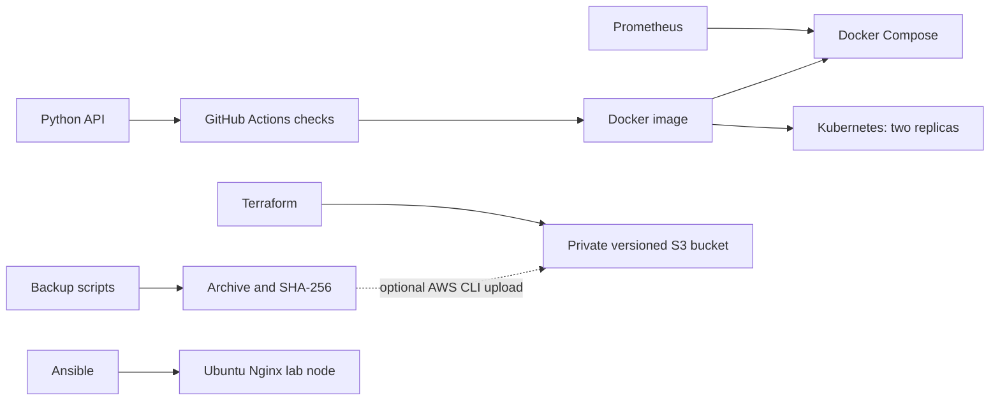

# DevOps Operations Lab

مشاريع عملية للتدريب على مهام Junior DevOps Engineer. ابدأ بـDocker ثم Kubernetes ثم المراقبة، وبعدها الأتمتة والبنية السحابية. ملفات التشغيل والتوثيق التقني بالإنجليزية لتناسب العمل ضمن فريق دولي.

| المجلد | المشروع | المهارات |
| --- | --- | --- |
| [docker](docker/README.md) | خدمة HTTP داخل حاوية محدودة الصلاحيات | Dockerfile, Compose, health checks, logs |
| [kubernates](kubernates/README.md) | نشر الخدمة بنسختين وتحديث تدريجي | Kubernetes, Kustomize, probes, rollback |
| [ci-cd](ci-cd/README.md) | فحص الكود والبنية وبناء الحاوية | GitHub Actions, tests, release procedure |
| [terraform](terraform/README.md) | مخزن نسخ احتياطي خاص على AWS | S3, encryption, versioning, TLS, IaC |
| [ansible](ansible/README.md) | تجهيز خادم Ubuntu بخدمة Nginx | configuration management, handlers, idempotency |
| [monitoring](monitoring/README.md) | مراقبة الخدمة وإنذار التوقف | Prometheus, PromQL, incident triage |
| [automation](automation/README.md) | نسخ الملفات واسترجاعها وتشخيص Linux | Bash, checksums, backup verification |

## البداية على Windows

شغّل Docker Desktop بوضع Linux containers، ثم نفّذ من هذا المجلد:

```powershell
docker compose -f docker/compose.yaml up -d --build --wait
curl.exe http://localhost:8080/healthz
```

تحتاج مشاريع Bash وAnsible إلى Linux أو WSL. يحتاج Kubernetes إلى عنقود محلي مثل kind. يحتاج Terraform إلى حساب AWS وبيانات اعتماد عبر ملف تعريف أو SSO؛ تنفيذ apply ينشئ موارد قد تترتب عليها تكلفة.

هذه مختبرات محلية وليست خدمة إنتاج عامة: الـAPI يستخدم خادم Python البسيط، ولا توجد بوابة TLS أو مصادقة للمستخدمين. لا تتضمن الملفات مفاتيح وصول أو ادعاءات بخبرة إنتاجية.

## Architecture



## كيف تعرض العمل في المقابلة

شغّل كل مشروع، نفّذ تمرين العطل، واحتفظ بنتائجك الفعلية: أوامر التشغيل، سبب العطل، طريقة التشخيص، وطريقة الإصلاح. اشرح سبب استخدام readiness مقابل liveness، وحدود النسخ الاحتياطي، والفرق بين Terraform وAnsible. راجع [سجل التحقق](VALIDATION.md) لمعرفة ما تم اختباره محليًا.
