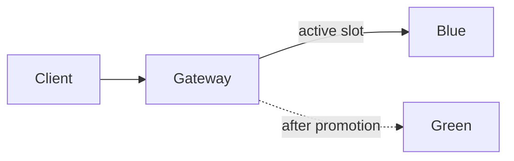

# Release Switchboard

A release lab for shipping a new application version while keeping the previous version available. Two slots, blue and green, run side by side. A gateway sends traffic to one slot; the other can be checked before promotion. Rolling back means sending traffic back to the previous slot.

Docker Compose uses Nginx as the gateway. Kubernetes uses a Service selector instead. Terraform and Ansible provide an optional AWS/K3s host, and GitLab builds the image and prepares a candidate release.



## Local run

Requirements: Docker with Compose and Bash. Run from this directory:

```bash
docker compose up -d --build --wait
curl http://localhost:8083/version
bash scripts/switch.sh green
curl http://localhost:8083/version
bash scripts/switch.sh blue
```

The response identifies the slot currently serving traffic. The switch script checks the target's health, validates the new Nginx configuration, reloads the gateway, and verifies a request through it. If verification fails, it restores the previous configuration. A directory lock prevents simultaneous local switches.

`bash scripts/smoke.sh` runs a promotion and rollback. To test rejection, stop green with `docker compose stop green`, then try switching to green while blue serves traffic. The health check should fail before routing changes. Restart green afterward.

## Kubernetes

Install kind and kubectl, then:

```bash
kind create cluster --name release-switchboard
docker build -t release-switchboard:dev .
kind load docker-image release-switchboard:dev --name release-switchboard
export KUBE_CONTEXT=kind-release-switchboard
export IMAGE=release-switchboard:dev
SLOT=blue bash scripts/deploy.sh
SLOT=green bash scripts/deploy.sh
bash scripts/promote.sh green
kubectl --context "$KUBE_CONTEXT" -n release-switchboard port-forward service/api 8083:80
```

Check `/version`, then use `bash scripts/promote.sh blue` to roll back. For a real release, tag and load a different image and deploy it only to the inactive slot. The deployment script refuses to update the active slot unless explicitly overridden with `ALLOW_ACTIVE_UPDATE=true`.

`kubectl kustomize kubernetes` is useful for reviewing the entire baseline. Applying that baseline directly resets both slots and the Service to blue, so use the deployment scripts for subsequent releases. Run promotions serially; the Kubernetes promotion script does not implement a distributed lock. Existing open connections can finish on the previous slot during a switch.

## Tests and delivery

```bash
python3 -m unittest discover -s tests -v
bash scripts/smoke.sh
```

The GitLab pipeline tests the service, exercises Compose switching, and publishes a commit-tagged image. Its manual deployment prepares the inactive slot; promotion remains a separate operator action. See [CI setup](docs/CI.md), [AWS provisioning](docs/CLOUD.md), and [validation results](VALIDATION.md).

## Operational limits

The demo's `/version` returns the slot name. Registry tags identify the actual build. Both slots initially run the same code so the traffic-switching exercise is easy to reproduce; deploy a new image to demonstrate a code release.

This is an HTTP-only lab with no public ingress, database migrations or user authentication. Health checks do not replace functional tests. The Nginx configuration under `gateway/` changes during local switching; return to blue before committing it. Stop Compose with `docker compose down`, or remove the local cluster with `kind delete cluster --name release-switchboard`.
