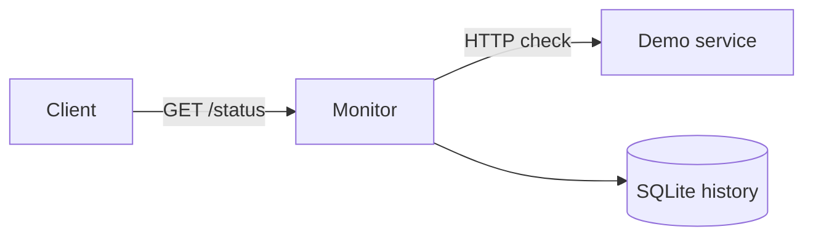

# Uptime Watch

A small availability monitor that checks configured HTTP endpoints, records results in SQLite, and exposes their current status through a JSON API. A target enters an alert state after three consecutive failed checks and clears when a check succeeds.

Unlike a single health endpoint, this project keeps a history of observations and reports availability over the last 24 hours. It includes a demo target so outage and recovery tests do not depend on a public website.



## Local run

Requirements: Docker with Compose and Bash. From this directory:

```bash
docker compose up -d --build --wait
curl http://localhost:8084/status
```

The response includes `up`, `alert`, `last_checked`, latency and `availability_percent`. Until the first observation, availability is unknown rather than reported as successful. Compose checks every two seconds, plus request time; the Kubernetes deployment defaults to ten seconds between polling rounds.

Run the failure exercise:

```bash
docker compose stop demo
# Wait for three failed observations, then inspect /status.
docker compose start demo
bash scripts/smoke.sh
```

The smoke script verifies initial availability, stops the target, waits for an alert, restarts it, and verifies recovery. It restores the target on exit. Alerts are exposed in JSON; no email or messaging service is configured.

## Configuration and storage

Edit `app/targets.json` for Compose, rebuild the monitor image, and restart it. Kubernetes reads targets from the ConfigMap in `kubernetes/workloads.yaml`; after changing it, apply the file and restart `deployment/monitor`. Target names must be unique. Only HTTP and HTTPS URLs are accepted.

Configure trusted endpoints only. The monitor intentionally permits private addresses for internal services, so this configuration must not be exposed as a public URL-submission API. HTTP redirects are followed. Response bodies are not retained. Observations older than seven days are removed when new checks are recorded. Availability is the percentage of successful samples, not a duration-weighted SLA calculation.

The monitor uses one replica and a Recreate deployment strategy because SQLite is stored on one persistent volume. A restart causes a short monitoring gap. `/healthz` checks the HTTP process; also inspect `last_checked` to detect a stalled poller. The monitor itself is a single point of failure in this lab.

## Backup

```bash
bash scripts/backup.sh
```

The script uses SQLite's online backup API, then copies the snapshot to `backups/`. Do not copy only the live database file while WAL writes are in progress. Run backups serially, retain a copy outside the host, and verify snapshots with Python's sqlite3 `PRAGMA integrity_check` before relying on them. History backups do not include target configuration.

## Kubernetes

```bash
kind create cluster --name uptime-watch
docker build -t uptime-watch:dev .
kind load docker-image uptime-watch:dev --name uptime-watch
export KUBE_CONTEXT=kind-uptime-watch
export IMAGE=uptime-watch:dev
bash scripts/deploy.sh
kubectl --context "$KUBE_CONTEXT" -n uptime-watch port-forward service/monitor 8084:80
```

The cluster needs a default StorageClass. Scale the demo deployment to zero to exercise failure detection, then restore it to one. The monitor's history stays on its PVC. The optional [AWS host](docs/CLOUD.md) uses K3s; [GitLab CI](docs/CI.md) builds and tests the same image.

## Tests and cleanup

```bash
python3 -m unittest discover -s tests -v
bash scripts/smoke.sh
docker compose down
```

Compose preserves history unless you add `-v`. Deleting the kind cluster removes its local volume. This lab has no API authentication or TLS; access it through localhost or an SSH tunnel. See [validation results](VALIDATION.md) for the checks actually completed.
